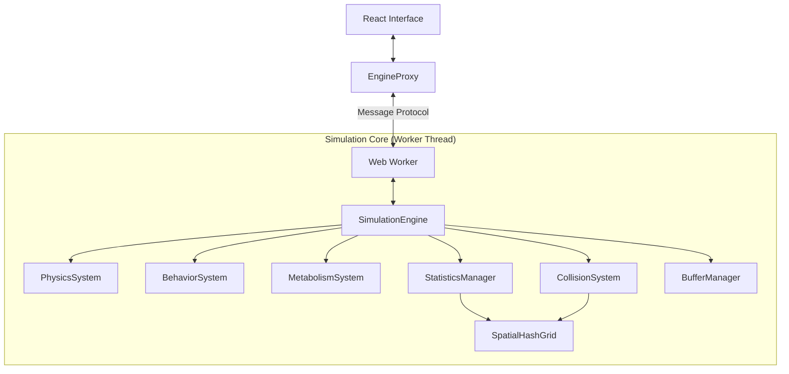

# Entropia 3D: Еволюційна Пісочниця

[](https://github.com/dogmator/entropia/actions)
[](https://www.typescriptlang.org/)

**Entropia 3D** — це високопродуктивна тривимірна симуляція еволюційних процесів, реалізована на основі агентного моделювання. Проект демонструє складну динаміку біологічних систем, де цифрові організми проходять природний відбір у детермінованому середовищі.

## 🚀 [Запустити Live Demo](https://dogmator.github.io/entropia/)

---

## 🧬 Архітектурна Концепція

Симуляція побудована на принципах **Data-Oriented Design** та **Service-Oriented Architecture (SOA)** для мінімізації навантаження на Garbage Collector та забезпечення максимальної пропускної здатності обчислювального ядра.

### 🏛️ Організація Системи



### 🧬 Концепція Ентропії
В рамках даної моделі ентропія виступає як **енерgetyчний податок на існування**:
- **📊 Метаболічний базис**: Постійна деградація енергії з часом.
- **🏃 Динамічні витрати**: Експоненційне зростання енерговитрат при інтенсивних діях (рух, прискорення).
- **📡 Сенсорне навантаження**: Вартість обробки просторової інформації (радіус сприйняття).

---

## 🛠️ Технологічний Стек та Оптимізації

| Сегмент | Технологія / Метод | Призначення |
|:---|:---|:---|
| **Ядро** | TypeScript 5 (Strict) | Детермінована логіка та типізація |
| **Графіка** | Three.js (WebGL 2) | Високопродуктивний рендеринг |
| **Threading** | Web Workers | Ізоляція обчислень від UI-потоку |
| **Memory** | TypedArrays (Float32) | Zero-copy передача даних (Transferables) |
| **Grid** | Spatial Hash Grid | Оптимізація просторових запитів O(1) avg |

### ⚡ Ключові Оптимізації (Phase 1-4)
1. **Object Pooling**: Реюзинг векторів та об'єктів станів для уникнення алокацій у критичних циклах.
2. **Buffer Management**: Адаптивне керування пам'яттю для Instanced Rendering.
3. **Engine Decomposition**: Виокремлення обчислення статистики (`StatisticsManager`) та керування буферами (`BufferManager`) у незалежні сервіси.
4. **Web Worker Migration**: Повна ізоляція симуляції в окремому фоновому потоці.

---

## 📂 Структура Проекту

```text
src/
├── core/                    # Базова інфраструктура (EventBus, PerformanceMonitor)
├── simulation/              # Ядро симуляції
│   ├── services/            # Статистика, Буфери, Спавн (SOA)
│   ├── systems/             # Фізика, Поведінка, Метаболізм (ECS)
│   ├── Engine.ts            # Координатор симуляції
│   └── EngineProxy.ts       # Main-thread інтерфейс до Worker
├── shared/                  # Branded Types та константи
└── ui/                      # React/Three.js Візуалізація
```

---

## 📦 Розгортання

### Локальне середовище
```bash
pnpm install
pnpm run dev      # Запуск середовища розробки
pnpm run test     # Запуск Unit-тестів
pnpm run check    # Повна перевірка (types + lint)
```

### Контейнеризація (Docker)
```bash
docker compose up -d
```
Додаток доступний за адресою: `http://localhost:3000/entropia/`

---

## 🔮 Roadmap Розвитку

- [x] **Phase 1-3**: Оптимізація пам'яті та декомпозиція ядра.
- [x] **Phase 4**: Інфраструктура Web Workers (Transferable Buffers).
- [/] **Phase 4.1**: Повна інтеграція UI з Worker Proxy.
- [/] **Phase 5**: UI Optimization & Diagnostics Refactoring.

---

## 📚 Документація та Аналіз

- [Архітектура Двигуна](./docs/ARCHITECTURE.md) — Детальний технічний опис та принципи роботи.
- [Віддалене Логування](./docs/REMOTE_LOGGING.md) — Налаштування та використання системи діагностики.
- [Оцінка роботи Worker](./docs/WORKER_EVALUATION.md) — Аналіз коректності та продуктивності фонових обчислень.
- [План Рефакторингу](./docs/REFACTORING_PLAN.md) — Детальний план модернізації архітектури.
- [Метрики якості проекту](./docs/QUALITY_METRICS.md) — Ключові показники стабільності коду.
- [Оптимізаційний план](docs/OPTIMIZATION_PLAN.md)
- [Принципи проекту для агентів](AGENTS.md)
