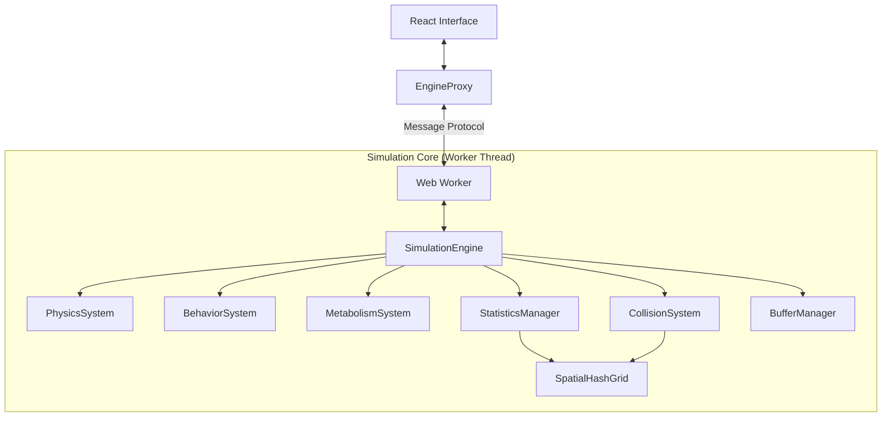

# Entropia 3D: Еволюційна Пісочниця

[](https://github.com/dogmator/entropia/actions)
[](https://www.typescriptlang.org/)

**Entropia 3D** — це високопродуктивна тривимірна симуляція еволюційних процесів, реалізована на основі агентного моделювання. Проект демонструє складну динаміку біологічних систем, де цифрові організми проходять природний відбір у детермінованому середовищі.

## 🚀 [Запустити Live Demo](https://dogmator.github.io/entropia/)

---

## 🧬 Архітектурна Концепція

Симуляція побудована на принципах **Data-Oriented Design** та **Service-Oriented Architecture (SOA)** для мінімізації навантаження на Garbage Collector та забезпечення максимальної пропускної здатності обчислювального ядра.

### 🏛️ Організація Системи


```mermaid
graph TD
    UI[React Interface] <--> Proxy[EngineProxy]
    Proxy <--> |Message Protocol| Worker[Web Worker]
    subgraph "Simulation Core (Worker Thread)"
        Worker <--> Engine[SimulationEngine]
        Engine --> Physics[PhysicsSystem]
        Engine --> Behavior[BehaviorSystem]
        Engine --> Metabolism[MetabolismSystem]
        Engine --> Collision[CollisionSystem]
        Engine --> Stats[StatisticsManager]
        Engine --> Buffers[BufferManager]
        Stats --> Grid[SpatialHashGrid]
        Collision --> Grid
    end
```

### 🧬 Концепція Ентропії
В рамках даної моделі ентропія виступає як **енерgetyчний податок на існування**:
- **📊 Метаболічний базис**: Постійна деградація енергії з часом.
- **🏃 Динамічні витрати**: Експоненційне зростання енерговитрат при інтенсивних діях (рух, прискорення).
- **📡 Сенсорне навантаження**: Вартість обробки просторової інформації (радіус сприйняття).

---

## 🛠️ Технологічний Стек та Оптимізації

| Сегмент | Технологія / Метод | Призначення |
|:---|:---|:---|
| **Ядро** | TypeScript 5 (Strict) | Детермінована логіка та типізація |
| **Графіка** | Three.js (WebGL 2) | Високопродуктивний рендеринг |
| **Threading** | Web Workers | Ізоляція обчислень від UI-потоку |
| **Memory** | TypedArrays (Float32) | Zero-copy передача даних (Transferables) |
| **Grid** | Spatial Hash Grid | Оптимізація просторових запитів O(1) avg |

### ⚡ Ключові Оптимізації (Phase 1-4)
1. **Object Pooling**: Реюзинг векторів та об'єктів станів для уникнення алокацій у критичних циклах.
2. **Buffer Management**: Адаптивне керування пам'яттю для Instanced Rendering.
3. **Engine Decomposition**: Виокремлення обчислення статистики (`StatisticsManager`) та керування буферами (`BufferManager`) у незалежні сервіси.
4. **Web Worker Migration**: Повна ізоляція симуляції в окремому фоновому потоці.

---

## 📂 Структура Проекту

```text
src/
├── core/                    # Базова інфраструктура (EventBus, PerformanceMonitor)
├── simulation/              # Ядро симуляції
│   ├── services/            # Статистика, Буфери, Спавн (SOA)
│   ├── systems/             # Фізика, Поведінка, Метаболізм (ECS)
│   ├── Engine.ts            # Координатор симуляції
│   └── EngineProxy.ts       # Main-thread інтерфейс до Worker
├── shared/                  # Branded Types та константи
└── ui/                      # React/Three.js Візуалізація
```

---

## 📦 Розгортання

### Локальне середовище
```bash
pnpm install
pnpm run dev      # Запуск середовища розробки
pnpm run test     # Запуск Unit-тестів
pnpm run check    # Повна перевірка (types + lint)
```

### Контейнеризація (Docker)
```bash
docker compose up -d
```
Додаток доступний за адресою: `http://localhost:3000/entropia/`

---


## 🧹 Refactoring Update: Logger (ТОП-8 smell-ів)

Останній цикл рефакторингу сфокусовано на `src/core/services/Logger.ts`:
- усунено **8 ключових smell-ів** (long parameter list, `any`, завищена складність, magic numbers);
- уніфіковано payload-підхід для логів та консольного перехоплення;
- додано unit-тести для регресії (дублікати, формат виводу, command notification, websocket reconnect, performance warning).
- стабілізовано `SimulationContext`: виправлено strict-типізацію remote command, виділено pure FPS helpers і додано тести `src/ui/context/__tests__/fps.test.ts`.

## 🔮 Roadmap Розвитку

- [x] **Phase 1-3**: Оптимізація пам'яті та декомпозиція ядра.
- [x] **Phase 4**: Інфраструктура Web Workers (Transferable Buffers).
- [/] **Phase 4.1**: Повна інтеграція UI з Worker Proxy.
- [/] **Phase 5**: UI Optimization & Diagnostics Refactoring.

---

## 📚 Документація та Аналіз

- [Архітектура Двигуна](./docs/ARCHITECTURE.md) — Детальний технічний опис та принципи роботи.
- [Віддалене Логування](./docs/REMOTE_LOGGING.md) — Налаштування та використання системи діагностики.
- [Оцінка роботи Worker](./docs/WORKER_EVALUATION.md) — Аналіз коректності та продуктивності фонових обчислень.
- [План Рефакторингу](./docs/REFACTORING_PLAN.md) — Детальний план модернізації архітектури.
- [Метрики якості проекту](./docs/QUALITY_METRICS.md) — Ключові показники стабільності коду.
- [Оптимізаційний план](docs/OPTIMIZATION_PLAN.md)
- [Звіт про тестування 2026-03-15](docs/TESTING_REPORT_2026-03-15.md)
- [Принципи проекту для агентів](AGENTS.md)

## 🧪 Refactoring Update: Academic Logging Hardening (32+ fixes)

Новий етап фокусувався на академічному hardening для logging stack:
- `scripts/log-server.ts`: строгі type-guards, без `any`, без nested ternary, централізація ANSI/command/error констант.
- `src/core/services/logger/transports/WebSocketTransport.ts`: підсилена надійність reconnect/send/flush, ідемпотентне перемикання remote transport.
- `src/core/services/logger/Logger.ts`: стабільні payload-сигнатури, контроль `maxLogs`, нормалізація `recent` інтервалів, O(1)-оновлення stats counters.
- Нове покриття unit-тестами для logger/transport критичних сценаріїв.

## 🔧 Logging v4 Stability Pass (64+ fixes)

Додатковий етап академічної стабілізації:
- посилено `src/core/services/Logger.ts` (safe dedup, bounded remote queue, reconnect lifecycle, immutability remote payload);
- посилено `src/core/services/logger/transports/WebSocketTransport.ts` (bounded queue + reconnect timer hygiene);
- посилено `scripts/log-server.ts` (payload/text caps, sanitize + safe parse diagnostics);
- `vite.config.ts` тепер безпечний для build у середовищах без `vite-plugin-checker` (checker вмикається лише через `VITE_ENABLE_CHECKER=true`);
- розширено unit-тести для logger/transport на edge-cases.

## Нове в симуляції: ріст та поетапне харчування
- **Їжа тепер споживається дискретно**: один контакт = один укус з cooldown.
- **Кристали їжі візуально зменшуються** відповідно до `currentEnergy`.
- **Організми народжуються малими** (близько 40% від adult-розміру) та ростуть за age+energy.
- **Аномалії стали непрохідними**: застосовується ковзання уздовж поверхні, відбиття використовується як fallback.
- **Розширено діагностику hover-панелі**: growth, maturity, adult/current radius, stuck ticks, current food energy.

## 🧾 QA Update (2026-03-15)
- Виконано повний доступний прогін перевірок якості (lint/typecheck/unit/build/coverage-attempt).
- Проведено browser-driven user-perspective smoke перевірку UI з артефактом screenshot.
- Підготовлено розширений звіт з виконаними/невиконаними перевірками і 4 блоками production-risk Top-3: `docs/TESTING_REPORT_2026-03-15.md`.

## 🚀 Production-impact update (2026-03-15)
- Декомпозовано update pipeline ядра симуляції та додано fail-safe guards для деградаційних станів.
- Реалізовано proxy/worker state contract (`exportState`/`importState`) і message оптимізації (dedup + batched config updates).
- Додано явне керування run/pause/stop в UI, clamp-захист налаштувань і degraded-state в діагностиці.
- Додано lazy-loading `SettingsPanel`/`DiagnosticsModal`, що зменшує pressure початкового UI-бандла.

## ✅ Merge Verification Pass (2026-03-15)
- Підтверджено order-safe поведінку `EngineProxy` batching/dedup для critical-команд.
- Додано unit-тест інваріанту серіалізації: `state === import(export(state))`.
- Підтверджено browser-driven, що lazy-loaded `SettingsPanel`/`DiagnosticsModal` коректно працюють з `SimulationContext`.

## 🔒 Stabilization pass (merge-readiness, 2026-03-15)
- Посилено order-safety batching/flush у `EngineProxy`.
- Додано повторний persistence-cycle test для виявлення дрейфу стану.
- Підтверджено стабільність regression-suite після точкових виправлень перед merge.
