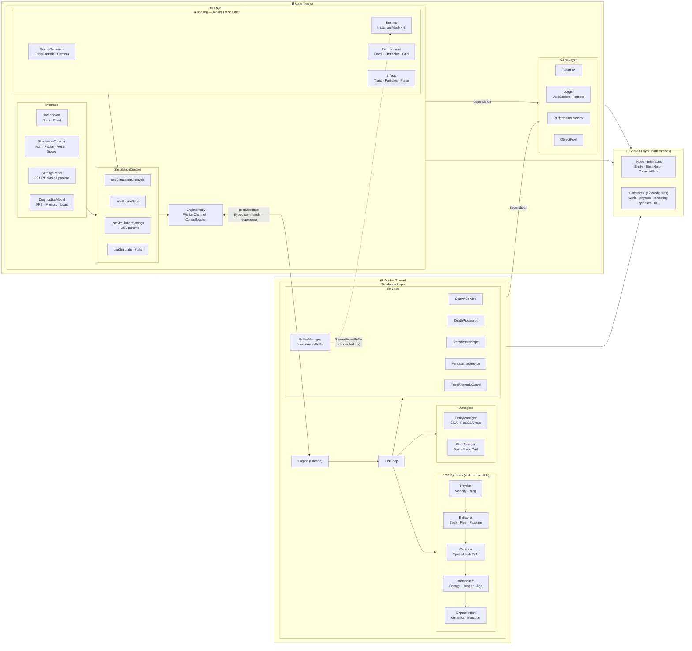

# Entropia 3D: Evolutionary Sandbox

[](https://github.com/dogmator/entropia/actions)
[](https://www.typescriptlang.org/)
[](https://react.dev/)
[](https://dogmator.github.io/entropia/)

**Entropia 3D** is a high-performance biological evolution simulator built with TypeScript, React, and Three.js. It simulates a complex ecosystem where digital organisms (Prey and Predators) evolve through natural selection, governed by genetic mutations and environmental entropy.

## Architecture


```mermaid
flowchart LR
    subgraph MAIN["🖥️  Main Thread"]
        direction TB

        subgraph UI["UI Layer"]
            direction TB
            PROXY["EngineProxy\nWorkerChannel · ConfigBatcher"]

            subgraph CTX_G["SimulationContext"]
                direction LR
                LC["useSimulationLifecycle"]
                ES["useEngineSync"]
                SS["useSimulationSettings\n→ URL params"]
                STS["useSimulationStats"]
            end

            subgraph R3F_G["Rendering — React Three Fiber"]
                direction LR
                SC["SceneContainer\nOrbitControls · Camera"]
                EN["Entities\nInstancedMesh × 3"]
                EV["Environment\nFood · Obstacles · Grid"]
                FX["Effects\nTrails · Particles · Pulse"]
            end

            subgraph SIDE_G["Interface"]
                direction LR
                DB["Dashboard\nStats · Chart"]
                CTRL["SimulationControls\nRun · Pause · Reset · Speed"]
                SP2["SettingsPanel\n29 URL-synced params"]
                DG["DiagnosticsModal\nFPS · Memory · Logs"]
            end
        end

        subgraph CORE_G["Core Layer"]
            direction LR
            EB["EventBus"]
            LG["Logger\nWebSocket · Remote"]
            PM["PerformanceMonitor"]
            OP["ObjectPool"]
        end
    end

    subgraph WORKER_G["⚙️  Worker Thread"]
        direction TB

        subgraph SIM_G["Simulation Layer"]
            direction TB
            ENG["Engine  (Facade)"]
            TL["TickLoop"]

            subgraph SYS_G["ECS Systems  (ordered per tick)"]
                direction TB
                PH["Physics\nvelocity · drag"]
                BE["Behavior\nSeek · Flee · Flocking"]
                CL["Collision\nSpatialHash O(1)"]
                ME["Metabolism\nEnergy · Hunger · Age"]
                RP["Reproduction\nGenetics · Mutation"]
                PH --> BE --> CL --> ME --> RP
            end

            subgraph MGR_G["Managers"]
                direction LR
                EM["EntityManager\nSOA · Float32Arrays"]
                GM["GridManager\nSpatialHashGrid"]
            end

            subgraph SVC_G["Services"]
                direction LR
                SV["SpawnService"]
                DP["DeathProcessor"]
                BM["BufferManager\nSharedArrayBuffer"]
                SM["StatisticsManager"]
                PS["PersistenceService"]
                FG["FoodAnomalyGuard"]
            end

            ENG --> TL
            TL --> SYS_G
            TL --> MGR_G
            TL --> SVC_G
        end
    end

    subgraph SH_G["🔗  Shared Layer  (both threads)"]
        direction LR
        TY["Types · Interfaces\nIEntity · IEntityInfo · CameraState"]
        CN["Constants  (12 config files)\nworld · physics · rendering · genetics · ui…"]
    end

    PROXY <-->|"postMessage\n(typed commands · responses)"| ENG
    BM -.->|"SharedArrayBuffer\n(render buffers)"| EN

    CTX_G --> PROXY
    R3F_G --> CTX_G
    SIDE_G --> CTX_G

    UI -->|depends on| CORE_G
    SIM_G -->|depends on| CORE_G
    CORE_G --> SH_G
    UI --> SH_G
    SIM_G --> SH_G
```

## 🚀 Quick Start

### Installation
```bash
pnpm install
```

### Development
```bash
pnpm dev
```
Starts the Vite dev server and the remote logging server.

### Scripts
- `pnpm dev`: Start development environment.
- `pnpm test`: Run unit tests via Vitest.
- `pnpm build`: Build for production.
- `pnpm tsc --noEmit`: Strict type checking.

## 🔗 URL Configuration (29 Parameters)

The simulation state is fully synchronized with the URL, allowing for shareable ecosystem snapshots.

### SimulationConfig (24 Parameters)
- **Visuals**: `organismOpacity`, `foodOpacity`, `organismScale`, `foodScale`, `bloomIntensity`, `showGrid`, `gridOpacity`, `trailLength`, `showEnergyGlow`, `showTrails`, `showParticles`, `graphicsQuality`.
- **Physics**: `drag`, `separationWeight`, `alignmentWeight`, `cohesionWeight`, `seekWeight`, `avoidWeight`.
- **Environment**: `foodSpawnRate`, `maxFood`, `maxOrganisms`, `showObstacles`, `mutationFactor`, `reproductionThreshold`.

### UI & Camera (5 + 6 Parameters)
- **UI Settings**: `speed`, `worldScale`, `autoRotate`, `autoRotateSpeed`, `cameraSnapshot`.
- **Camera Details** (via `cameraSnapshot`): `camX`, `camY`, `camZ`, `camTX`, `camTY`, `camTZ`.

## 🛠️ Tech Stack
- **Language**: TypeScript 5 (Strict)
- **Framework**: React 19
- **Graphics**: Three.js / React Three Fiber
- **Bundler**: Vite
- **Testing**: Vitest
- **Package Manager**: pnpm

---
*For contribution guidelines, see [CONTRIBUTING.md](./CONTRIBUTING.md).*
