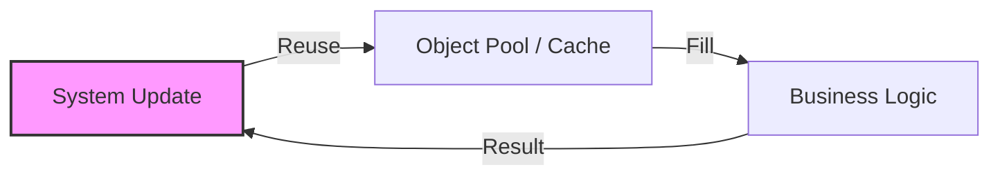
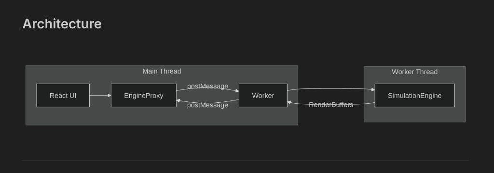
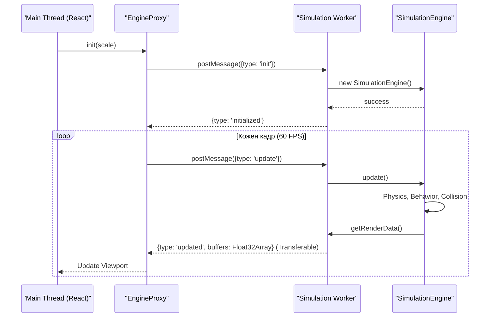

# Архітектура Двигуна Симуляції (Simulation Engine)

Цей документ містить технічний опис внутрішньої архітектури Entropia 3D, механізмів оптимізації та принципів взаємодії компонентів.

## 🏛️ Огляд Архітектури

Система базується на гібридному підході, що поєднує **ECS (Entity Component System)** для логіки агентів та **SOA (Service-Oriented Architecture)** для інфраструктурних задач.

### Основні Компоненти

| Компонент | Роль у системі | Технічна реалізація |
|:---|:---|:---|
| `SimulationEngine` | Головний оркестратор | Цикл оновлення (Update Loop), керування життєвим циклом сутностей |
| `StatisticsManager` | Аналітичне обчислення | Кешування метрик, аналіз популяції, стан камери |
| `BufferManager` | Керування пам'яттю | Адаптивна алокація Float32Array для Instanced Rendering |
| `SpatialHashGrid` | Просторова індексація | Хешування координат для O(1) пошуку сусідів |

---

## 🏎️ Оптимізація Продуктивності (Performance Engineering)

### 1. Мінімізація тиску на Garbage Collector (GC)
У критичних шляхах обчислень (60 разів на секунду) повністю виключено динамічну алокацію об'єктів.

#### 🛠️ Методи:
- **Object Pooling**: Використання `forceAccumulators` у `BehaviorSystem` для накопичення сил без створення нових векторів.
- **Reusable Result Buffers**: `SpatialHashGrid` використовує внутрішні сталі масиви для повернення результатів пошуку сусідів.
- **Metabolic Breakdown Caching**: `MetabolismSystem` заповнює існуючий об'єкт замість повернення нового.

### 2. Просторова Декомпозиція
Використання **Spatial Hash Grid** дозволяє обмежити кількість перевірок колізій та взаємодій лише найближчими сусідами.
- **Середня складність**: $O(1)$ для пошуку в радіусі.
- **Масштабування**: Ефективність не деградує при збільшенні розміру світу, лише при екстремальній щільності.

---

## 🧵 Багатопотоковість (Web Workers)

Для забезпечення стабільного UI-потоку (React/Main Thread), симуляція ізольована у Web Worker. Це дозволяє розділити контекст відмальовування інтерфейсу та інтенсивні математичні обчислення.

### Візуалізація Архітектури

### Протокол Синхронізації

### Аналіз Підходу: Переваги та Недоліки

Використання Web Workers для обчислювального ядра надає значні переваги для масштабованості, проте вносить певні архітектурні обмеження.

#### Переваги (Advantages):
1. **🚀 UI Responsiveness (60 FPS UI)**: Навіть при складності симуляції, що перевищує бюджет кадру (16.6 мс), інтерфейс та анімації залишаються плавними, оскільки основний потік не блокується.
2. **💎 Паралелізація**: Сучасні процесори використовують окреме ядро для Worker, що фізично збільшує доступну обчислювальну потужність.
3. **🛡️ Ізоляція збоїв**: Помилка в циклі симуляції не призводить до "зависання" всієї вкладки браузера, дозволяючи коректно обробити виняткову ситуацію.
4. **📉 Zero-copy Transfer**: Використання трансферабельних об'єктів (`Float32Array`) нівелює витрати на копіювання великих масивів даних.

#### Недоліки (Disadvantages):
1. **🛰️ Затримка комунікації (Latency)**: Повідомлення `postMessage` мають мікроскопічну затримку (serialize/deserialize overhead), що може бути критичним для VR-додатків або high-speed action систем.
2. **🧩 Складність синхронізації**: Асинхронна природа взаємодії вимагає складнішої архітектури (Proxy-об'єкти, системи повідомлень) замість прямого виклику методів.
3. **🐞 Складність налагодження**: Debugging багатопотокових систем ускладнюється через нелінійність виконання та обмежену підтримку деяких інструментів розробника для Worker context.

### 🛡️ Реалізовані Рішення для Мінімізації Затримки

#### 1. SharedArrayBuffer (Zero-Latency Shared Memory) ✅
Замість передачі даних через `postMessage`, обидва потоки працюють з **спільною ділянкою пам'яті**.
- **Статус**: Впроваджено.
- **Як працює**: Створюється `SharedArrayBuffer`, який мапиться на `TypedArray` в обох потоках. Зміни, внесені Worker-ом, миттєво доступні в Main Thread.
- **Інфраструктура**: Налаштовано `Cross-Origin-Opener-Policy: same-origin` та `Cross-Origin-Embedder-Policy: require-corp` для підтримки shared memory.

#### 2. Client-Side Interpolation & Prediction (Інтерполяція та Прогнозування)
Main Thread не просто відображає останній стан, а "передбачає" рух об'єктів між пакетами даних від Worker-а.
- **Як працює**: Якщо Worker присилає дані 30 разів на секунду, а UI працює при 60 FPS, Main Thread інтерполює позицію об'єкта між попереднім та поточним кадрами.
- **Перевага**: Візуальна плавність 144+ FPS навіть при низькому Tick Rate симуляції. Гравку здається, що система працює миттєво.

#### 3. Adaptive Batching & Triple Buffering (Потрійна Буферизація)
Використання декількох буферів для паралельного читання та запису.
- **Як працює**: Поки GPU читає `Buffer A`, Worker записує результати наступного кроку в `Buffer B`, а `Buffer C` готується до наступного циклу.
- **Перевага**: Усуває "тремтіння" (jitter) та "паузи", коли Main Thread чекає на завершення обчислень Worker-а. Це дозволяє симуляції працювати з випередженням графіки.

### Передача Даних (Transferable Objects)
Використання `Float32Array` баферів дозволяє передавати великі масиви даних про положення агентів між потоками без копіювання (zero-copy), що критично для продуктивності на мобільних пристроях та слабких системах.

---

## 🧬 Генетична Модель

Кожен агент володіє геномом, що кодується структурою `Genome`. 
- **Мутагенез**: При репродукції параметри (швидкість, метаболізм, колір) змінюються на випадковий коефіцієнт мутації.
- **Природний відбір**: Агенти з неефективною конфігурацією швидше втрачають енергію (ентропія) та гинуть до моменту репродукції.

---

## 📊 Формат Даних Рендерингу (Render Buffers)

Дані передаються плоскими масивами для GPU Instancing:

| Набір | Stride | Дані (per instance) |
|:---|:---:|:---|
| **Prey / Predator** | 13 | `x, y, z, vx, vy, vz, radius, rot, id, reserved[4]` |
| **Food** | 4 | `x, y, z, scale` |

---

## ✨ Висновок
Поточна архітектура Entropia 3D фокусується на ефективному використанні ресурсів CPU та пам'яті, що дозволяє симулювати тисячі незалежних агентів у браузері без втрати плавності інтерфейсу.
