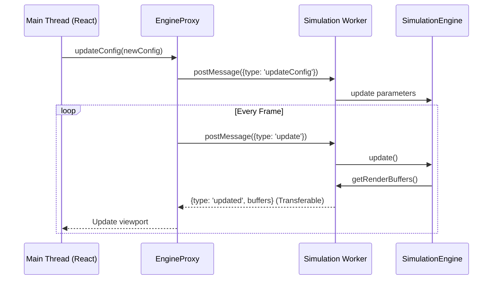

# Simulation Engine Architecture

This document provides a technical description of Entropia 3D's internal architecture, optimization mechanisms, and component interaction principles.

## 🏛️ Architecture Overview

The system is based on a 4-layer architectural pattern combined with **ECS (Entity Component System)** for agent logic and **SOA (Service-Oriented Architecture)** for infrastructure tasks.

### Layers

1. **Shared**: Fundamental types and constants.
2. **Core**: Global services (EventBus, Logger).
3. **Simulation**: The math-heavy engine (running in a Web Worker).
4. **UI**: React-based visualization and controls.

### Core Simulation Components

| Component | Role in the system | Technical implementation |
|:---|:---|:---|
| `SimulationEngine` | Main orchestrator | Update loop, entity lifecycle management |
| `StatisticsManager` | Analytical computation | Metric caching, population analysis |
| `BufferManager` | Memory management | Adaptive Float32Array allocation for Instanced Rendering |
| `SpatialHashGrid` | Spatial indexing | Coordinate hashing for O(1) neighbor search |

---

## 🏎️ Performance Engineering

### 1. Minimizing Garbage Collector (GC) Pressure
Dynamic object allocation is eliminated in critical computational paths (60 ticks/sec).

#### Methods:
- **Object Pooling**: Reusing vectors and force accumulators.
- **Reusable Result Buffers**: `SpatialHashGrid` returns results in pre-allocated arrays.
- **In-place Updates**: Systems modify entity state directly or via pre-allocated structures.

### 2. Spatial Decomposition
The **Spatial Hash Grid** enables O(1) average neighbor lookups, allowing the simulation to scale with world size.

---

## 🧵 Multithreading (Web Workers)

The simulation runs in a dedicated Web Worker to keep the UI thread responsive at 60+ FPS.

### Component Interaction

```mermaid
sequenceDiagram
    participant UI as Main Thread (React)
    participant Proxy as EngineProxy
    participant Worker as Simulation Worker
    participant Engine as SimulationEngine

    UI->>Proxy: updateConfig(newConfig)
    Proxy->>Worker: postMessage({type: 'updateConfig'})
    Worker->>Engine: update parameters
    
    loop Every Frame
        Proxy->>Worker: postMessage({type: 'update'})
        Worker->>Engine: update()
        Engine->>Worker: getRenderBuffers()
        Worker-->>Proxy: {type: 'updated', buffers} (Transferable)
        Proxy-->>UI: Update viewport
    end
```

### Key Optimizations
- **Transferable Objects**: Zero-copy data transfer of `Float32Array` buffers.
- **Cadence Splitting**: The simulation can run at a higher frequency than the render snapshot dispatch.
- **Triple Buffering**: Parallel read/write cycles to eliminate jitter.

---

## 🧬 Genetic Model

- **Genome**: Encodes speed, metabolism, color, and behavior.
- **Mutagenesis**: Random factor applied during reproduction.
- **Natural Selection**: Entities with inefficient configurations die due to "entropy" (energy loss).

---

## 🔍 Observability

Entropia 3D integrates a remote logging system for real-time monitoring. See [DEVELOPMENT.md](./DEVELOPMENT.md) for setup instructions.
